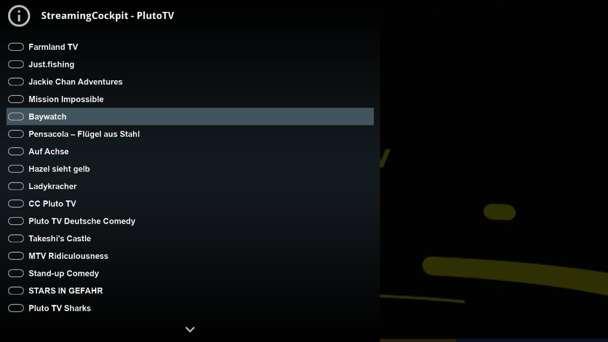
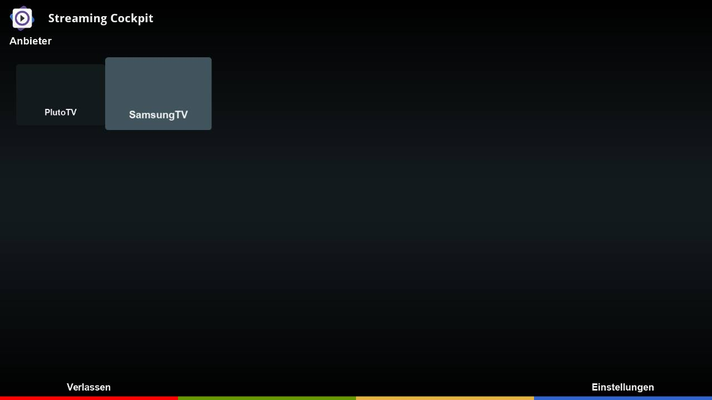
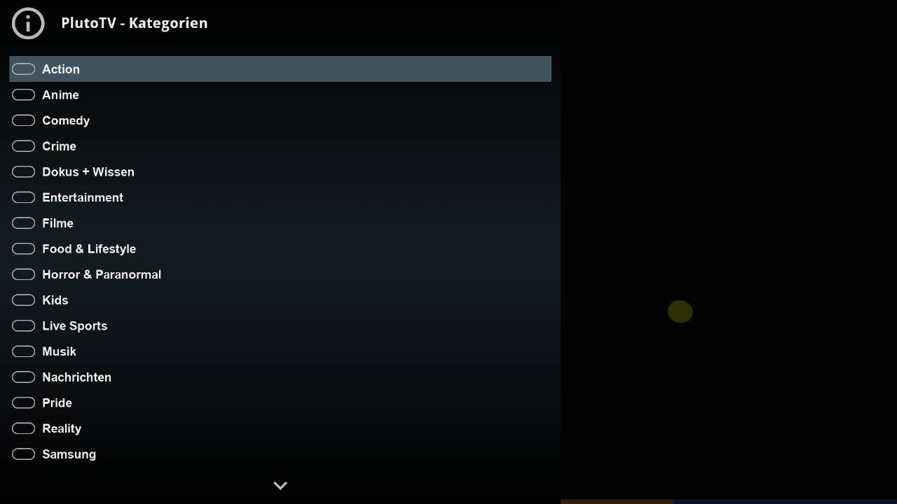
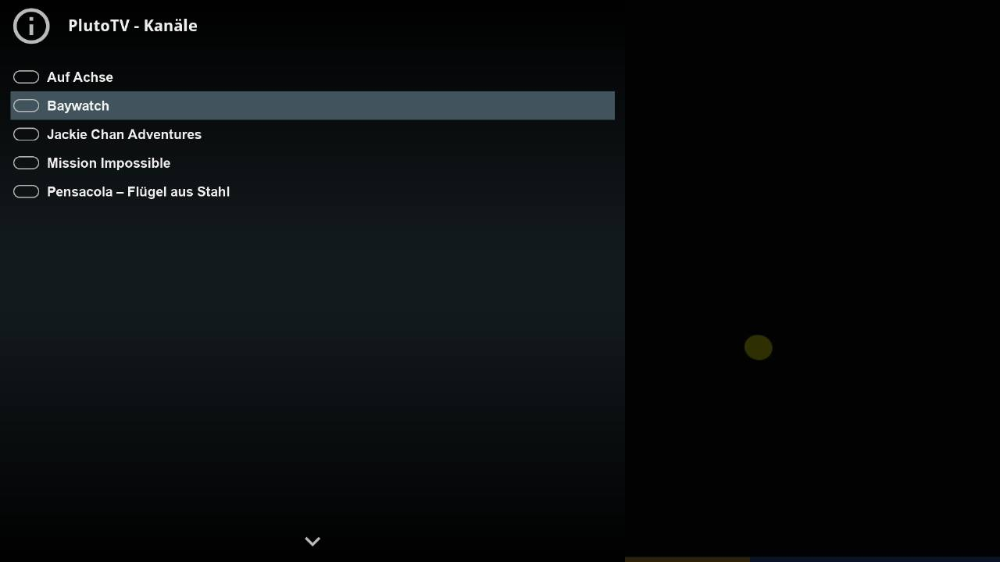

# StreamingCockpit (STC)

StreamingCockpit is a DreamOS plugin for playback of IPTV live streams. 

## Features
- Plays back IPTV streams
- Supports multiple providers
- Comprises 3 components:
	- GUI frontend in python2
	- Streaming server in python3
	- Ubuntu chroot subsystem providing a python3 programming environment
- Best viewing experience with skin: https://github.com/dream-alpha/Shadow-FHD

## Limitations
- STC supports DreamOS only.
- STC is being tested on DM 920 and DM ONE only.

## Languages
- english
- german

## Links
- Installation: https://dream-alpha.github.io/StreamingCockpit
- Support: https://github.com/dream-alpha/StreamingCockpit/discussions
