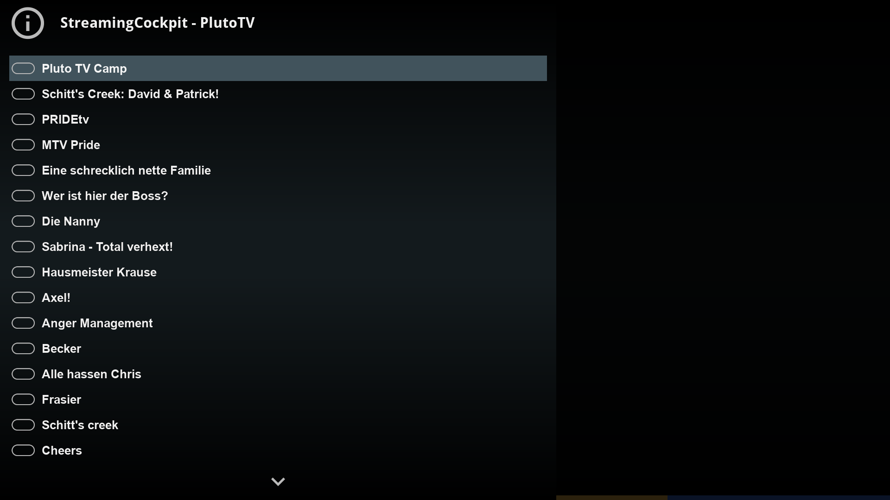

# StreamingCockpit (STC)

StreamingCockpit is the GUI frontend for the streamingserver plugin (which is running on the dreambox ubuntu subsystem)

## Features
- Plays back IPTV streams.

## Limitations
- STC supports DreamOS only.
- STC is being tested on DM 920 and DM ONE only.

## Languages
- english
- german

## Links
- Installation: https://dream-alpha.github.io/StreamingCockpit
- Support: https://github.com/dream-alpha/StreamingCockpit/discussions
