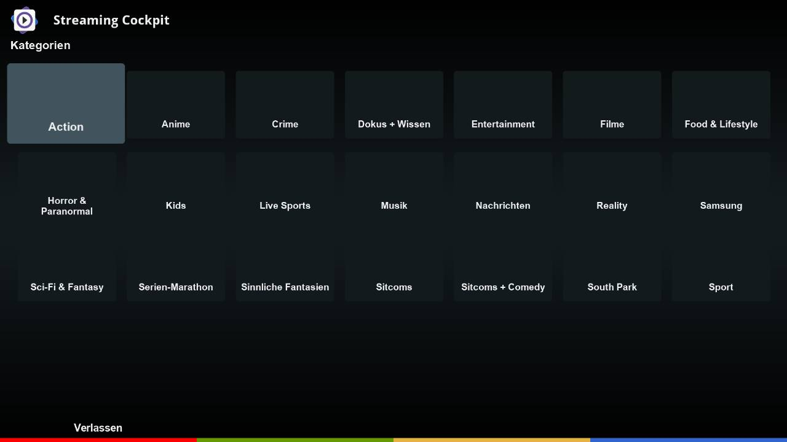
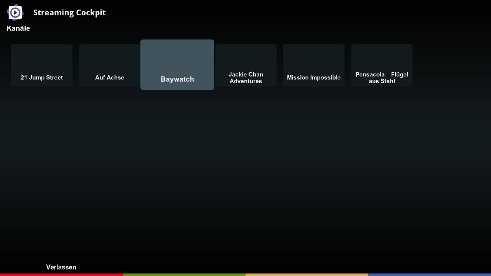

# StreamingCockpit (STC)

StreamingCockpit is a DreamOS plugin for playback of IPTV live and VOD streams. 

## Features
- Plays back IPTV and VOD streams
- Supports multiple providers with plugin concept
- Comprises 3 components:
	- Python 2 GUI frontend
	- Python 3 Streaming server
	- Ubuntu chroot subsystem providing a python 3 programming environment
- Best viewing experience with skin: https://github.com/dream-alpha/Shadow-FHD

## Limitations
- STC supports DreamOS only.
- STC is being tested on DM 920 and DM ONE only.

## Languages
- english
- german

## Links
- Installation: https://dream-alpha.github.io/StreamingCockpit
- Support: https://github.com/dream-alpha/StreamingCockpit/discussions
